# Day-1: CI Pipeline + Shift-Left Security

## 🎯 Overview

Welcome to Day 1 of the **7-Day DevSecOps MasterClass**! Today, we built a complete CI pipeline integrated with multiple shift-left security tools to catch vulnerabilities early in the development lifecycle.

### Pipeline Flow

<p align="center">
    
</p>

## 📋 Topics Covered

### Infrastructure Setup

- **AWS EC2 Instance Configuration**
  - Instance Type: `t3.large`
  - Architecture: `x86-64`
  - Cost Optimization: Spot Instance
  - Operating System: Ubuntu 24.04

### Core Components

- Jenkins CI Server Setup
- Multi-stage Jenkins Pipeline Configuration
- IAM Role Configuration for AWS Services
- Git Webhook Automation for Triggered Builds

### Shift-Left Security Tools

| Tool                       | Purpose                               | Category           |
| -------------------------- | ------------------------------------- | ------------------ |
| **Snyk**                   | Software Composition Analysis         | SCA                |
| **SonarQube**              | Static Application Security Testing   | SAST               |
| **Gitleaks**               | Secret Scanning                       | Secret Detection   |
| **OWASP Dependency-Check** | Dependency Vulnerability Analysis     | SCA                |
| **Syft**                   | Software Bill of Materials Generation | SBOM               |
| **Dockle**                 | Docker Image Linting                  | Container Security |

### Additional Components

- **Nexus Repository Manager**: Unified storage for Docker images and npm packages
- **Docker**: Container runtime for application deployment
- **Multi-stage Dockerfiles**: Optimized builds for MERN stack applications

## 🚀 Learning Outcomes

By the end of Day 1, you'll have:

✅ A fully automated CI pipeline with security scanning at every stage  
✅ Break-the-build logic for High/Critical vulnerabilities  
✅ Secure Docker images following industry best practices  
✅ Automated vulnerability reporting and tracking  
✅ Integration with artifact repositories

## 🛠️ Installation & Setup

### Automated Installation Script

All required tools are installed using a single script:

```bash
#!/bin/bash
# install-tools.sh - One-click installation for all DevSecOps tools

# This script installs:
# - Docker
# - Jenkins
# - SonarQube
# - Nexus Repository Manager
# - Dockle
# - Gitleaks
# - Syft

chmod +x install-tools.sh
./install-tools.sh
```

### Manual Verification

After installation, verify each tool:

```bash
# Check Docker
docker --version

# Check Jenkins
sudo systemctl status jenkins

# Check running containers
docker ps
```

## 📸 Implementation Screenshots

### 1. EC2 Spot Instance Configuration

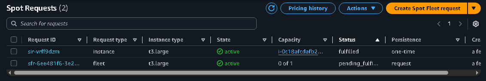

Successfully created EC2 spot instances for cost-effective infrastructure.

### 2. Security Group Configuration

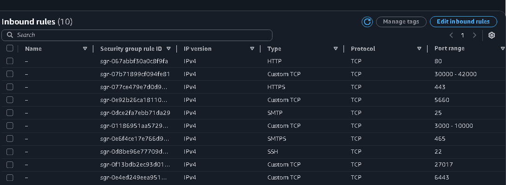

Configured inbound rules for:

- Jenkins (8080)
- SonarQube (9000)
- Nexus (8081)
- Application ports (3000-10000, 30000-42000)
- SSH (22), SMTP (25, 465), HTTPS (443)

### 3. Docker Installation

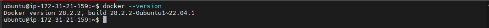

Docker version 28.2.2 successfully installed on Ubuntu 22.04.1.

### 4. Running Containers


All essential containers running:

- Jenkins (Port 8080)
- Nexus (Port 8081)
- SonarQube (Port 9000)

### 5. Docker Images

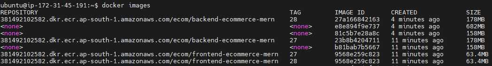

Local Docker images including:

- Backend e-commerce images (178MB)
- Frontend e-commerce images (63.4MB)

### 6. Jenkins Dashboard

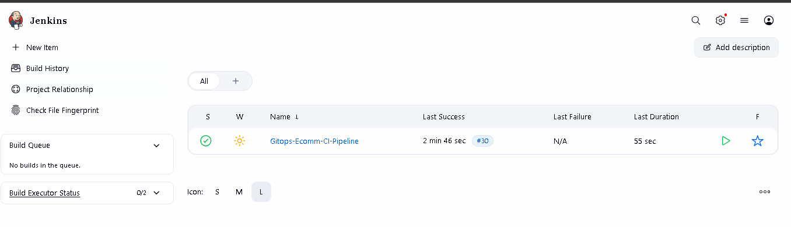

Jenkins pipeline "Gitops-Ecomm-CI-Pipeline" configured with:

- Last successful build: 2 min 46 sec ago
- Build #30 completed
- 55 seconds duration

### 7. Jenkins Service Status

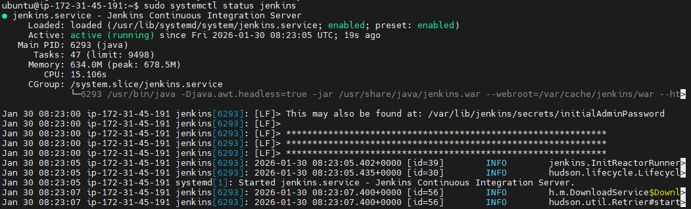

Jenkins service actively running with:

- Process ID: 6293 (Java)
- Memory Usage: 634.0M
- Active since: Fri 2026-01-30 08:23:05 UTC

### 8. Jenkins Credentials Management

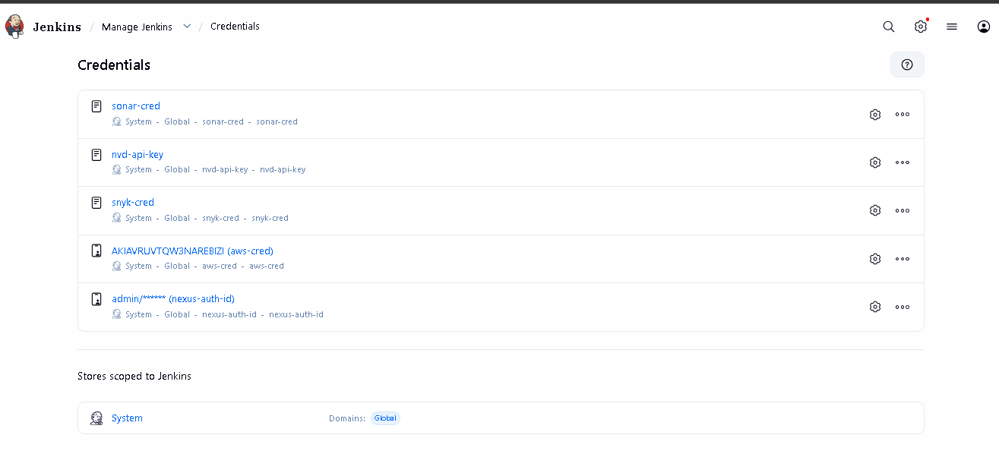

Configured credentials:

- `sonar-cred` - SonarQube authentication
- `nvd-api-key` - NVD vulnerability database API
- `snyk-cred` - Snyk security scanning
- `aws-cred` - AWS ECR access
- `nexus-auth-id` - Nexus repository authentication

### 9. SonarQube Analysis Results

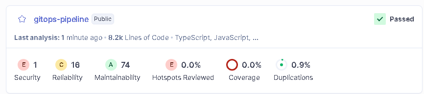

Code quality metrics:

- **Security Issues**: 1 (E rating)
- **Reliability Issues**: 16 (C rating)
- **Maintainability**: 74 (A rating)
- **Coverage**: 0.0%
- **Duplications**: 0.9%
- **Lines of Code**: 8.2K (TypeScript, JavaScript)

### 10. Nexus Repository Dashboard

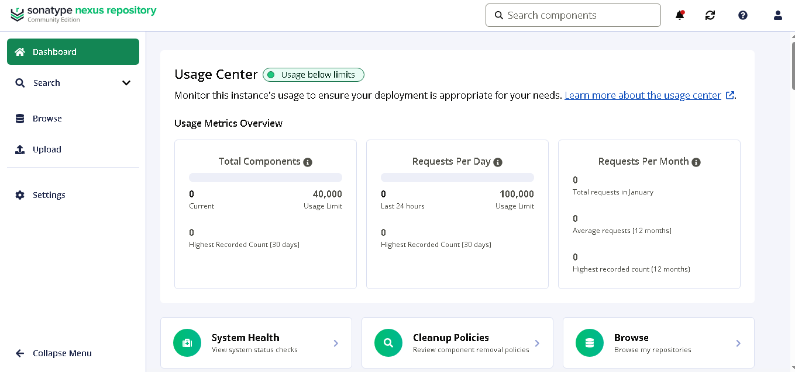

Nexus Repository Manager showing:

- Total Components: 0 (Usage limit: 40,000)
- Requests Per Day: 0 (Usage limit: 100,000)
- System Health: Active

### 11. Nexus Configuration in Jenkins

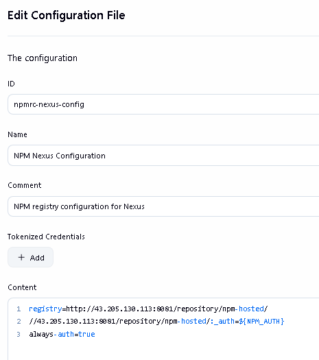

NPM registry configuration:

```
registry=http://43.205.130.113:8081/repository/npm-hosted/
//43.205.130.113:8081/repository/npm-hosted/:_auth=${NPM_AUTH}
always-auth=true
```

### 12. NPM Hosted Repository

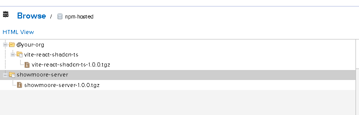

Nexus npm-hosted repository showing:

- vite-react-shadcnts-1.0.0.tgz
- showmoore-server-1.0.0.tgz

### 13. AWS ECR Repositories

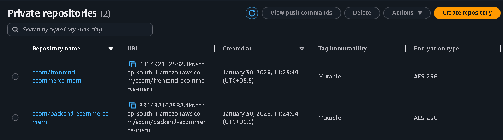

Private repositories created:

- `ecom/frontend-ecommerce-mern` (Created: Jan 30, 2026, 11:23:49)
- `ecom/backend-ecommerce-mern` (Created: Jan 30, 2026, 11:24:04)

### 14. Backend ECR Images

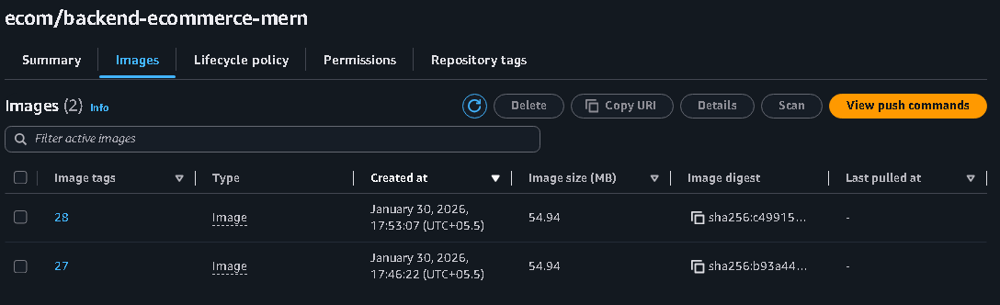

Backend repository with 2 images:

- Tag 28 (54.94 MB) - Pushed: Jan 30, 2026, 17:53:07
- Tag 27 (54.94 MB) - Pushed: Jan 30, 2026, 17:46:22

### 15. Frontend ECR Images

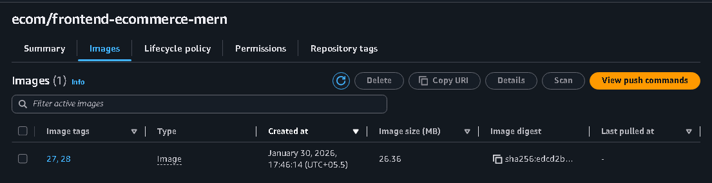

Frontend repository with 1 image:

- Tags 27, 28 (26.36 MB) - Pushed: Jan 30, 2026, 17:46:14

### 16. OWASP Dependency-Check Report

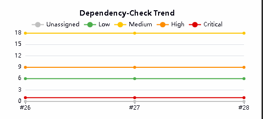

Vulnerability severity distribution:

- **Critical**: 1
- **High**: 9
- **Medium**: 18
- **Low**: 6

Key vulnerabilities detected:

- `@babel/runtime@7.25.9` - Multiple CVEs (High severity)
- `@eslint/plugin-kit@0.2.3` - Multiple CVEs (High/Low severity)
- `axios.js` - CVE-2025-56754 (High severity)

### 17. Dependency-Check Trend

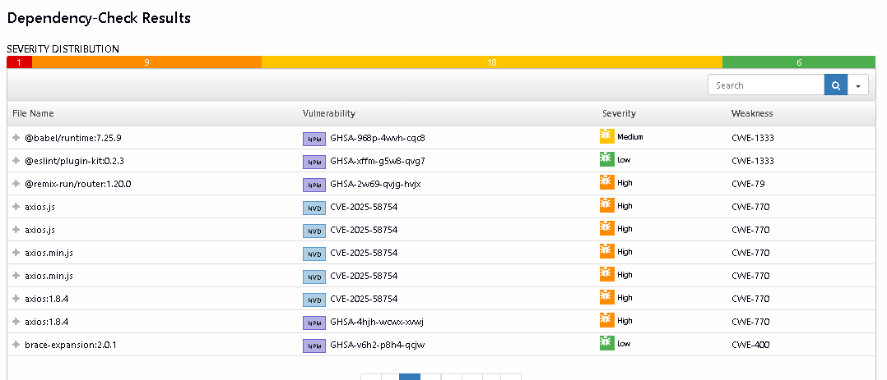

Trend analysis across builds:

- Unassigned: 18 (stable)
- Low: 6 (stable)
- Medium: 18 (stable)
- High: 9 (stable)
- Critical: 1 (stable)

Build comparison (#26 → #27 → #28) showing consistent vulnerability tracking.

### 18. Pipeline Build Reports

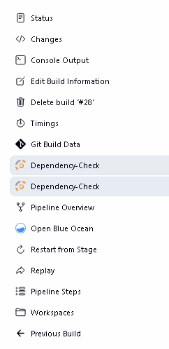

Available reports in Jenkins:

- Dependency-Check (2 instances)
- Pipeline Overview
- Open Blue Ocean
- Git Build Data
- Pipeline Steps

### 19. Pipeline Stages Execution

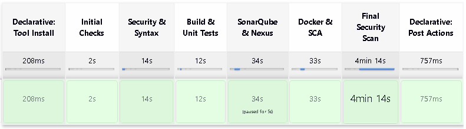

Complete pipeline execution flow:

1. **Declarative: Tool Install** - 208ms
2. **Initial Checks** - 2s
3. **Security & Syntax** - 14s
4. **Build & Unit Tests** - 12s
5. **SonarQube & Nexus** - 34s (Skipped for #28)
6. **Docker & SCA** - 33s
7. **Final Security Scan** - 4min 14s
8. **Declarative: Post Actions** - 757ms

**Total Duration**: ~5 minutes per build

### 20. Jenkins Artifact Reports

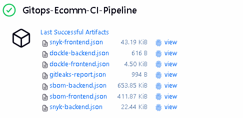

Build artifacts generated:

- `snyk-frontend.json` (43.19 KB)
- `dockle-backend.json` (616 B)
- `dockle-frontend.json` (4.50 KB)
- `gitleaks-report.json` (994 B)
- `sbom-backend.json` (653.85 KB)
- `sbom-frontend.json` (411.87 KB)
- `snyk-backend.json` (22.44 KB)

## 🏗️ Pipeline Architecture

### Stage Breakdown

```
1. Declarative: Tool Install
   └─> Install required tools and dependencies

2. Initial Checks
   └─> Git checkout and environment validation

3. Security & Syntax
   ├─> Gitleaks secret scanning
   ├─> Snyk SCA scanning (frontend + backend)
   └─> Syntax validation

4. Build & Unit Tests
   ├─> npm install (frontend + backend)
   └─> npm test execution

5. SonarQube & Nexus
   ├─> SonarQube code analysis
   └─> Artifact upload to Nexus

6. Docker & SCA
   ├─> Multi-stage Docker builds
   ├─> Dockle image linting
   ├─> Syft SBOM generation
   └─> OWASP Dependency-Check

7. Final Security Scan
   ├─> Push to AWS ECR
   └─> Final vulnerability assessment

8. Declarative: Post Actions
   └─> Artifact archival and notifications
```

## 🔒 Security Best Practices Implemented

### Docker Security

- ✅ Multi-stage builds for minimal image size
- ✅ Alpine-based images (lightweight & secure)
- ✅ Non-root user execution
- ✅ `.dockerignore` for sensitive files exclusion
- ✅ Minimal layer architecture
- ✅ No secrets in images

### Pipeline Security

- ✅ Break-the-build for High/Critical vulnerabilities
- ✅ Credential management via Jenkins Credentials Store
- ✅ Secret scanning with Gitleaks
- ✅ SBOM generation for supply chain security
- ✅ Container image scanning with Dockle
- ✅ Dependency vulnerability checks

### Access Control

- ✅ IAM roles for AWS services
- ✅ Security groups with least privilege
- ✅ Nexus authentication
- ✅ SonarQube token-based auth
- ✅ API key rotation support

## 📊 Key Metrics

| Metric                       | Value      |
| ---------------------------- | ---------- |
| Pipeline Stages              | 8          |
| Security Tools               | 6          |
| Average Build Time           | ~5 minutes |
| Docker Image Size (Backend)  | 178 MB     |
| Docker Image Size (Frontend) | 63.4 MB    |
| Lines of Code Analyzed       | 8.2K       |
| Total Vulnerabilities Found  | 34         |
| Critical Vulnerabilities     | 1          |

## 🎓 Key Takeaways

1. **Shift-Left Security** catches vulnerabilities before production
2. **Automated scanning** reduces manual security review time
3. **Break-the-build** policies enforce security standards
4. **Container security** is crucial for cloud-native applications
5. **SBOM generation** provides supply chain transparency
6. **Multi-stage builds** optimize image size and security

## 🔗 Resources

- [Jenkins Documentation](https://www.jenkins.io/doc/)
- [SonarQube Best Practices](https://docs.sonarqube.org/latest/)
- [Snyk CLI Documentation](https://docs.snyk.io/snyk-cli)
- [OWASP Dependency-Check](https://owasp.org/www-project-dependency-check/)
- [Docker Security Best Practices](https://docs.docker.com/develop/security-best-practices/)
- [Gitleaks Documentation](https://github.com/gitleaks/gitleaks)

## 🚀 Next Steps

- **Day 2**: Kubernetes deployment with GitOps
- **Day 3**: Advanced monitoring and observability
- **Day 4**: Runtime security and compliance
- **Day 5**: Infrastructure as Code (IaC) security
- **Day 6**: Incident response automation
- **Day 7**: Security compliance and governance

## 📝 Notes

- All images are stored in `./images/` directory
- Pipeline configuration available in `Jenkinsfile`
- Docker configurations in respective `Dockerfile` files
- Installation script: `install-tools.sh`

---

**Date**: January 30, 2026  
**Duration**: Full Day  
**Status**: ✅ Completed

---

_Happy DevSecOps Learning! 🔐_
